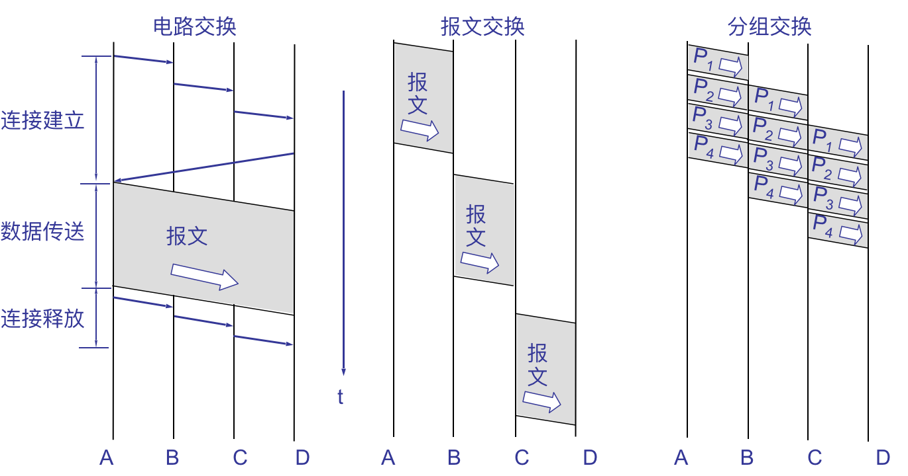

Computer Networks

###Overview

1. 现在有三种最主要的网络: 电信网络(电话网); 有线电视网络; 计算机(数据)网络

2. **电路交换的特点**
电路交换必定是**面向连接**的。 
电路交换的三个阶段: **建立连接; 通信; 释放连接**
电路交换传送计算机数据效率低, 因为计算机数据具有突发性, 这导致通信线路的利用率很低。

3. **分组交换的原理**
在发送端, 先**把较长的报文划分成较短的、固定长度的数据段**。
每一个数据段前面添加上**首部**构成分组。
分组交换网以“分组”作为数据传输单元, 依次把各分组发送到接收端。
最后, 在接收端把收到的数据恢复成为原来的报文。

> 分组首部的重要性
**每一个**分组的首部都含有**地址**等控制信息。
分组交换网中的结点交换机根据收到的分组的首部中的**地址信息**, 把分组**转发**到下一个结点交换机。
用这样的**存储转发方式**, 最后分组就能到达最终目的地。

4. 结点交换机
在结点交换机中的输入和输出端口之间**没有直接连线**。
结点交换机处理分组的过程是: 把收到的分组先放入**缓存(暂时存储)**; 查找**转发表**, 找出到某个目的地址应从哪个端口转发; 把分组送到适当的**端口**转发出去。 

5. 分组交换的优点
**高效**: 动态分配传输带宽，对通信链路是逐段占用。 
**灵活**: 以分组为传送单位和查找路由。
**迅速**: 不必先建立连接就能向其他主机发送分组；充分使用链路的带宽。
**可靠**: 完善的网络协议；自适应的路由选择协议使网络有很好的生存性。   

6. 分组交换带来的问题
分组在各结点存储转发时需要**排队**，这就会造成一定的**时延**。 
分组必须携带的**首部**(里面有必不可少的控制信息)也造成了一定的开销。 

> 早期的面向终端的计算机网络是以单个主机为中心的星形网
> 	各终端通过通信线路共享昂贵的中心主机的硬件和软件资源。 
> 分组交换网则是**以网络为中心**，主机都处在网络的外围。
> 	用户通过分组交换网可共享连接在网络上的许多硬件和各种丰富的软件资源。  

7. **计算机网络的不同定义**
计算机网络是一些互相连接的、自治的计算机的集合。

8. **计算机网络的主要性能指标**
**发送时延(传输时延)**: 发送数据时，数据块从结点进入到传输媒体所需要的时间。
**信道带宽**: 数据在信道上的发送速率。常称为数据在信道上的**传输速率**。
(例如，带宽是 10 M，实际上是 10 Mb/s。这里的 M 是 $10^6$。 ) 
**传播时延**: 电磁波在信道中需要传播一定的距离而花费的时间。 
(信号**传输速率**(即发送速率)和信号在信道上的**传播速率**是完全不同的概念。)
**处理时延**: 交换结点为存储转发而进行一些必要的处理所花费的时间。处理时延的长短往往取决于网络中当时的通信量。
- 发送时延 = 数据块长度(bit) / 信道带宽(bit/s)
- 传播时延 = 信道长度(米)/ 信号在信道上的传播速率(米/秒)
- 总时延 = 发送时延 + 传播时延 + 处理时延
- 时延带宽积 = 传播时延 * 带宽
- (链路的时延带宽积又称为以比特为单位的链路长度, 表示链路可容纳多少比特)
- **往返时延 RTT** (Round-Trip Time) 表示从发送端发送数据开始，到发送端收到来自接收端的确认(接收端收到数据后立即发送确认)，总共经历的时延。 
**评价计算机网络性能的指标: 发送延迟, 传播延迟。**

> 常见的错误混淆了两种速率
> 在网络中有两种不同的速率：
> - 信号(即电磁波)在传输媒体上的传播速率(米/秒，或公里/秒)
> - 计算机向网络发送比特的速率(比特/秒)
> 宽带线路：每秒有更多比特从计算机注入到线路。
> 宽带线路和窄带线路上比特的传播速率是一样的。
>
> 对于高速网络链路，我们提高的仅仅是**数据的发送速率**而**不是比特在链路上的传播速率**。

9. 常见的几种计算机连网方法
点对点, 星行网, 总线网, 环形网。

10. 计算机网络的分类
从网络的交换功能进行分类;(电路交换, 报文交换, 分组交换, 混合交换)
从网络的作用范围进行分类;(WAN, LAN, 城域网 MAN, 接入网 AN (Access Network))
从网络的使用者进行分类(公用网 (public network), 专用网 (private network) )

11. 计算机网络的体系结构 
计算机网络的**体系结构(architecture)**是**计算机网络的各层及其协议**的集合。 
体系结构就是这个计算机网络及其部件所应完成的功能的**精确定义**。
**实现(implementation)**是遵循这种体系结构的前提下用何种硬件或软件完成这些功能的问题。
体系结构是抽象的，而实现则是具体的，是真正在运行的计算机硬件和软件。  

12. **划分层次的必要性**
- 计算机网络中的数据交换必须遵守事先约定好的规则。 
- 这些规则明确规定了所交换的数据的格式以及有关的同步问题(同步含有时序的意思)。
- 为进行网络中的数据交换而建立的规则、标准或约定即网络协议(network protocol)，简称为协议。  

> 分层的好处: 各层之间是独立的; 灵活性好; 结构上可分割开; 易于实现和维护; 能促进标准化工作。  

13. **实体、协议、服务
和服务访问点**[极其重要]
**实体(entity)** 表示任何可发送或接收信息的硬件或软件进程。 
**协议**是控制**两个对等实体**进行通信的规则的集合。 
在协议的控制下，两个对等实体间的通信使得本层能够**向上一层提供服务**。
要实现本层协议，还需要使用下层所提供的服务。 
本层的服务用户只能看见服务而无法看见下面的协议。
下面的协议对上面的服务用户是透明的。 
**协议是“水平的”，即协议是控制对等实体之间通信的规则。**
**服务是“垂直的”，即服务是由下层向上层通过层间接口提供的。**
同一系统相邻两层的实体进行交互的地方，称为**服务访问点 SAP (Service Access Point)**。

> 在计算机网络中，协议(protocol)是通信双方必须严格遵守的规则。
> **协议**精确地规定在网络通信中使用的各种控制信息的格式、意义以及各种事件出现的先后顺序。
> 协议在计算机网络中起着非常重要的作用。
> 协议必须保证在任何复杂的情况下都能正确工作，因此网络协议非常复杂。

14. **网络协议的组成要素**
语法: 数据与控制信息的结构或格式 。 
语义: 需要发出何种控制信息，完成何种动作以及做出何种响应。 
同步: 事件实现顺序的详细说明。 

15. 分层
三种体系结构: OSI 7层, 每一层都提供了服务。
TCPIP结构, 四层结构。只提供三层服务, 网络结构层未提供服务。
将OSI的链路层拿到TCPIP中讨论则为5层, 但TCPIP是4层(严格)。

> **TCP/IP 是四层的体系结构：应用层、运输层、网际层和网络接口层。**最下面的网络接口层并没有具体内容。
> 因此往往采取折中的办法，即综合 OSI 和 TCP/IP 的优点，采用一种只有五层协议的体系结构 。 

16. 面向连接服务与
无连接服务
- 面向连接服务(connection-oriented): 面向连接服务具有连接建立、数据传输和连接释放这三个阶段。   
- 无连接服务(connectionless): 两个实体之间的通信不需要先建立好连接。是一种不可靠的服务。这种服务常被描述为“尽最大努力交付”(best effort delivery)或“尽力而为”。 

17. IP and everything
IP over Everything: IP 可应用到各式各样的网络上

18. **客户-服务器方式**
计算机的**进程(process)**就是运行着的计算机程序。为解决具体应用问题而彼此通信的进程称为“应用进程”。
应用层的具体内容就是规定应用进程在通信时所遵循的协议。在网络环境下，许多问题的解决往往是通过位于不同主机中的多个进程之间的通信和协同工作来完成的。在 TCP/IP 的应用层协议使用的是**客户-服务器**方式。
**客户(client)和服务器(server)都是指通信中所涉及的两个应用进程。**
客户-服务器方式所描述的是进程之间服务和被服务的关系。
**客户是服务请求方，服务器是服务提供方。**

> 客户软件的特点 
> 在进行通信时临时成为客户，但它也可在本地进行其他的计算。
> 被用户调用并在用户计算机上运行，在打算通信时主动向远地服务器发起通信。可与多个服务器进行通信。
> 不需要特殊的硬件和很复杂的操作系统。
> 服务器软件的特点
> 专门用来提供某种服务的程序，可同时处理多个远地或本地客户的请求。
> 在共享计算机上运行。当系统启动时即自动调用并一直不断地运行着。
> 被动等待并接受来自多个客户的通信请求。
> 一般需要强大的硬件和高级的操作系统支持。

19. 物理层
术语和概念
数据(data)——运送信息的实体。
信号(signal)——数据的电气的或电磁的表现。 
“模拟的”(analogous)——连续变化的。“数字的”(digital)——取值是离散数值。
调制——把数字信号转换为模拟信号的过程。解调——把模拟信号转换为数字信号的过程。 
**物理层的基本概念**: 物理层的主要任务为描述确定与传输媒体的接口的一些特性，即：
- **机械特性**: 指明接口所用接线器的形状和尺寸、引线数目和排列、固定和锁定装置等等。
- **电气特性**: 指明在接口电缆的各条线上出现的电压的范围。
- **功能特性**: 指明某条线上出现的某一电平的电压表示何种意义。
- **规程特性**: 指明对于不同功能的各种可能事件的出现顺序。 
目的: 尽量在最少的时间内将最多的信息正确地传递到最远的地方
主要任务: 描述确定与传输媒体的接口及其特性

20. 导向传输媒体和非导向传输媒体
**双绞线; 同轴电缆; 光缆**
短波通信主要是靠电离层的反射，但短波信道的通信质量较差。
微波在空间主要是直线传播。

> 有关信号的几个基本概念
> 单向通信（单工通信）——只能有一个方向的通信而没有反方向的交互。
> 双向交替通信（半双工通信）——通信的双方都可以发送信息，但不能双方同时发送(当然也就不能同时接收)。
> 双向同时通信（全双工通信）——通信的双方可以同时发送和接收信息。 
>
> **基带信号**就是将数字信号 1 或 0 直接用两种不同的电压来表示，然后送到线路上去传输。 
> **宽带信号**则是将基带信号进行调制后形成的频分复用模拟信号。 
>
> 波特是码元传输的速率单位（每秒传多少个码元）。码元传输速率也称为调制速率、波形速率或符号速率。信息的传输速率“比特/秒”与码元的传输速率“波特”在数量上有一定的关系。若 1 个码元只携带 1 bit 的信息量，则“比特/秒”和“波特”在数值上相等。若 1 个码元携带 n bit 的信息量，则 M Baud 的码元传输速率所对应的信息传输速率为 M × n b/s。 
> 比特是信息量的单位。  

###数据链路层

1. 基本概念
**链路(link)**: 是一条无源的点到点的物理线路段，中间没有任何其他的交换结点。
**数据链路(data link)**: 除了物理线路外，还必须有通信协议来控制这些数据的传输。若把实现这些协议的硬件和软件加到链路上，就构成了数据链路。
现在最常用的方法是使用适配器（即网卡）来实现这些协议的硬件和软件。一般的适配器都包括了数据链路层和物理层这两层的功能。   

2. **数据链路层的主要功能**(必考)
(1) 链路管理; 2)帧定界; 3)流量控制; 4)差错控制; 5)将数据和控制信息区分开; 6)透明传输; 7)寻址    

3. 实用的停止等待协议

> 超时计时器的作用
> 结点A发送完一个数据帧时，就启动一个超时计时器(timeout timer)。计时器又称为定时器。
> 若到了超时计时器所设置的重传时间 $t_{out}$ 而仍收不到结点 B 的任何确认帧，则结点 A 就重传前面所发送的这一数据帧。
> 一般可将重传时间选为略大于“从发完数据帧到收到确认帧所需的平均时间”。
>
> 解决重复帧的问题
> 使每一个数据帧带上不同的发送序号。每发送一个新的数据帧就把它的发送序号加 1。 
> 若结点 B 收到发送序号相同的数据帧，就表明出现了重复帧。这时应丢弃重复帧，因为已经收到过同样的数据帧并且也交给了主机 B。
> 但此时结点 B 还必须向 A 发送确认帧 ACK，因为 B 已经知道 A 还没有收到上一次发过去的确认帧 ACK。    
>
> 帧的编号问题 
> 任何一个编号系统的序号所占用的比特数一定是有限的。因此，经过一段时间后，发送序号就会重复。 
> 序号占用的比特数越少，数据传输的额外开销就越小。 
> 对于停止等待协议，由于每发送一个数据帧就停止等待，因此用一个比特来编号就够了。一个比特可表示 0 和 1 两种不同的序号。 
>
> 可靠传输 
> 虽然物理层在传输比特时会出现差错，但由于数据链路层的停止等待协议采用了有效的检错重传机制，数据链路层对上面的网络层就可以提供**可靠传输**的服务。 

4. 帧检验序列 FCS
**在数据后面添加上的冗余码称为帧检验序列 FCS (Frame Check Sequence)。**
**帧检验序列是必须的**, crc不是必须的。
循环冗余检验 CRC 和帧检验序列 FCS并不等同。CRC 是一种常用的检错方法，而 FCS 是添加在数据后面的冗余码。FCS 可以用 CRC 这种方法得出，但 CRC 并非用来获得 FCS 的惟一方法。 

> Attention:
> 仅用循环冗余检验 CRC 差错检测技术**只能做到无差错接受(accept)**。
> “无差错接受”是指：“凡是接受的帧（即不包括丢弃的帧），我们都能以非常接近于 1 的概率认为这些帧在传输过程中没有产生差错”。
> 也就是说：“凡是接受的帧都没有传输差错”（有差错的帧就丢弃而不接受）。
> **要做到“可靠传输”（即发送什么就收到什么）就必须再加上确认和重传机制。**

5. 停止等待协议 ARQ 的优缺点 
优点：比较简单 。
缺点：通信信道的利用率不高，也就是说，信道还远远没有被数据比特填满。
为了克服这一缺点，就产生了另外两种协议，即连续 ARQ 和选择重传 ARQ。这将在后面进一步讨论。  

6. 连续 ARQ 协议

在发送完一个数据帧后，不是停下来等待确认帧，而是可以连续再发送若干个数据帧。
如果这时收到了接收端发来的确认帧，那么还可以接着发送数据帧。
由于减少了等待时间，整个通信的吞吐量就提高了。
Attention: 接收端只按序接收数据帧。虽然在有差错的 2号帧之后接着又收到了正确的 3 个数据帧，但接收端都必须将这些帧丢弃，因为在这些帧前面有一个 2 号帧还没有收到。虽然丢弃了这些不按序的无差错帧，但应重复发送已发送过的最后一个确认帧（防止确认帧丢失）。

7. 滑动窗口的概念
发送端和接收端分别设定发送窗口和接收窗口 。
发送窗口用来对发送端进行流量控制。
发送窗口的大小 $W_T$ 代表在还没有收到对方确认信息的情况下发送端最多可以发送多少个数据帧。
**接收端设置接收窗口**
在接收端只有当收到的数据帧的发送序号落入接收窗口内才允许将该数据帧收下。 
若接收到的数据帧落在接收窗口之外，则一律将其丢弃。 
在连续 ARQ 协议中，接收窗口的大小 WR = 1。只有当收到的帧的序号与接收窗口一致时才能接收该帧。否则，就丢弃它。每收到一个序号正确的帧，接收窗口就向前（即向右方）滑动一个帧的位置。同时发送对该帧的确认。     

> **滑动窗口的重要特性**
> 只有在接收窗口向前滑动时（与此同时也发送了确认），发送窗口才有可能向前滑动。
> 收发两端的窗口按照以上规律不断地向前滑动，因此这种协议又称为滑动窗口协议。
> 当发送窗口和接收窗口的大小都等于 1时，就是停止等待协议。  
>
> 发送窗口的最大值 
> 当用 n 个比特进行编号时，若接收窗口的大小为 1，则只有在发送窗口的大小 $W_T ≤ 2^n − 1$时，连续 ARQ 协议才能正确运行。
> 例如，当采用 3 bit 编码时，发送窗口的最大值是 7 而不是 8。 

> 信道利用率
> 由于每个数据帧都必须包括一定的控制信息(如帧的序号、地址、同步信息以及其他的一些控制信息)，所以即使连续不停地发送数据帧，信道利用率(即扣除全部的控制信息后的数据率与信道容量之比)也不可能达到 100 %。 
> 当出现差错时(这是不可避免的)，数据帧的不断重传将进一步使信道利用率降低。 
> 若数据帧的帧长取得很短，那么控制信息在每一帧中所占的比例就增大，因而额外开销增大，这就导致信道利用率的下降。
> 若帧长取得太长，则数据帧在传输过程中出错的概率就增大，于是重传次数将增大，这也会使信道利用率下降。
> 由此可见，存在一个**最佳帧长**，在此帧长下信道的利用率最高。 

8. **选择重传 ARQ 协议**
可加大接收窗口，先收下发送序号不连续但仍处在接收窗口中的那些数据帧。等到所缺序号的数据帧收到后再一并送交主机。 
选择重传 ARQ 协议可避免重复传送那些本来已经正确到达接收端的数据帧。
但我们付出的代价是在接收端要设置具有相当容量的缓存空间。
对于选择重传 ARQ 协议，若用 n 比特进行编号，则接收窗口的最大值受下式的约束 $W_R ≤ 2^n/2$

> 发送和接收窗户的大小必须是相同的，而且最大取值最大序列号的一半（序列号是假设编号从0到 n -1），为了当所有数据包都丢失时避免出错。假设所有的ACK都丢失了，如果接收窗口大于最大序列号的一半，一些甚至可能是所有的超时重传的帧，都是不能被识别的重复发送。
> 接收窗口的尺寸不能超过序号范围的1/2，否则可能造成帧的重叠。另外，发送窗口的尺寸一般和接收窗口的尺寸相同，发送端为每一个发送缓存设置一个定时计数器，定时器一旦超时，相应输出缓存区中的帧就被重发。

9. **零比特填充法**

(标志字段 F (Flag) 为 6 个连续 1 加上两边各一个 0 共 8 bit。在接收端只要找到标志字段就可确定一个帧的位置)
HDLC 采用零比特填充法使一帧中两个 F 字段之间不会出现 6 个连续 1。
**方法：在帧的传输起始标志和结束标志之间，每当出现5个1之后，发送器就会插入一个附加的0。一旦有5个1模式出现，就会检查第6个比特。若为0，该比特将被删除。若为1，且第7个比特为0，那么这个组合被认为是标志字段。若第六位和第七位都为1，则此时处于异常终止状态。**
在接收帧时，先找到 F 字段以确定帧的边界。接着再对比特流进行扫描。每当发现 5 个连续 1 时，就将其后的一个 0 删除，以还原成原来的比特流。 

10. 字符填充法(PPP)
将信息字段中出现的每一个 0x7E 字节转变成为 2 字节序列(0x7D, 0x5E)。 
若信息字段中出现一个 0x7D 的字节, 则将其转变成为 2 字节序列(0x7D, 0x5D)。
若信息字段中出现 ASCII 码的控制字符（即数值小于 0x20 的字符），则在该字符前面要加入一个 0x7D 字节，同时将该字符的编码加以改变。
\
PPP 协议之所以不使用序号和确认机制是出于以下的考虑：
- 在数据链路层出现差错的概率不大时，使用比较简单的 PPP 协议较为合理。
- 在因特网环境下，PPP 的信息字段放入的数据是 IP 数据报。数据链路层的可靠传输并不能够保证网络层的传输也是可靠的。
- 帧检验序列 FCS 字段可保证无差错接受。

> 透明传输 
> 采用零比特填充法就可传送任意组合的比特流，或者说，就可实现数据链路层的**透明传输**。
> 当连续传输两个帧时，前一个帧的结束标志字段 F 可以兼作后一帧的起始标志字段。
>
> PPP 是面向字节的，所有的 PPP 帧的长度都是整数字节。  

**由收方控制发方的数据流，乃是计算机网络中流量控制的一个基本方法。**

###Getting Connected

1. 什么是直连网络?
所有的主机通过某种物理媒质直接连接。

2. 直连网络问题在体系结构中所处的层次?
1) L1(物理层) 处理物理传输媒质上的数字通信问题, 特别是比特如何表示为模拟信号; 
2) 直连网络的研究主要集中于L2(数据链路层)

3. 适配器之间的通信
**发送端**
- 将分组封装为数据帧
- 增加差错检测、可靠传输、流量控制等功能
**接收端**
- 完成差错检测、实施可靠传输、流量控制等
- 提取分组并交付之上层协议

> 物理层为上层提供比特流传输服务
>
> 数据链路层在哪里实现?
> 1) 挂载在主机的系统总线上; 
> 2) 数据链路层以适配器的形式实现 (aka 网络接口卡NIC) 或者集成在芯片上。[以太网卡, 802.11无线网卡;以太网芯片] 通常数据链路层和物理层联合实现; 
> 3) 挂载在主机的系统总线上; 
> 4)包含硬件、软件和固件
>
> IEEE 802将数据链路层功能划分为两个子层
> **LLC (逻辑链路控制)** 子层(驱动程序实现)
> 功能: 差错检测, 可靠传输;
> **MAC (介质访问控制)** 子层(硬件实现)
> 功能: 帧定界, 寻址, 多路访问控制
> 与传输媒质特点和网络适配器的设计目前相关, NIC (网络接口卡)  

4. 节点能成功的交换分组之前, 需解决的五个问题
- 编码: 对发送到电缆或光纤上的比特进行编码, 使其能被接收主机所理解
- 帧定界: 把物理链路上传输的比特序列描述为完整的消息, 以便传送到端节点
- 差错检测: 检测帧传送过程种可能出现的错误, 并采取相应的动作
- 可靠传输: 保证链路在帧不时可能出现错误情况下的可靠性
- 通信链路共享(介质访问控制): 如果链路静态共享, 很容易处理; 如果链路动态共享, 如何控制多个主机的访问顺序? 

5. 关于网络节点
- 网络适配器是节点接入网络的专用设备
- 内存访问速度可能成为节点性能的瓶颈
- 网络中的两种稀缺资源: 节点的内存及网络链路带宽

6. 关于网络适配器
**功能**
- 进行串行/并行转换
- 对数据进行缓存
- 设备驱动程序(数据链路层协议)
**接口特性**
- 机械特性:接口所用接线器的形状和尺寸、引线数目和排列、固定和锁定装置等等.
- 电气特性:在接口电缆的各条线上出现的电压的范围.
- 功能特性:某条线上出现的某一电平的电压表示何种意义.
- 规程特性:对于不同功能的各种可能事件的出现顺序.

7. 链路
**物理传输媒质**
- 导向型媒质: 信号在固态媒质上传播, 例如同轴电缆, 光纤, 双绞线
- 非导向型媒质: 信号自由传播, 例如电磁波

8. 面向字节的协议
**面向字节**: 把每一帧看做一个字节(字符)集合
**两种方法**: 字符计数法; 起止标记法

9. 比特错误
**解决方案**
- 差错检测: 接收方可以通过编码方式检测到差错
- 差错纠正, 通常有两种方法: 1)接收方通知发送方重发消息; 2)接收方重新构造消息

10. 可靠传输
**基本解决方法**
- ACK (确认): 接收方根据差错检测的结果向发送方发送一个小的控制帧进行确认[ACK = 正确接收, NAK = 帧错误]
- 超时: 如果发送方在一定的时间范围内未收到来自接受方的确认, 则重传数据帧
- 帧序号: 识别数据帧

11. 自动请求重传 (ARQ)
- ARQ: 采用确认和超时定时器的可靠传输机制
- 链路层假设: 1)串行通信信道, 传输过程中不存在帧的乱序; 2)所有数据帧的传播时延相同
- 接收方: 1)对数据帧进行差错检测; 2)对正确帧进行确认, 丢失错误帧; 3)丢弃禁止接收的数据帧
- 发送方: 1)发送原始数据帧; 2)对错误帧和丢失帧进行重传

12. 停止等待协议
- 最简单的ARQ机制
- 每发送完一个数据帧, 发送方在继续发送下一个数据帧之前必须等待确认
- 如果在一定的时间范围内, 发送方未收到确认(ACK), 则发送定时器超时激发, 发送方重传原始数据帧
**缺点**: 链路带宽利用率较低
示例: 链路带宽为$2Mbps$, $RTT$为$45ms$, 数据帧大小为$1.5KB$
每一个$RTT$内, 发送方仅能发送一个数据帧; 吞吐量为$1500*8/0.045 = 266.7Kbps$
**如何改进**: 充分利用“管道”流水传送(连续ARQ协议)

13. 流水线协议
**流水线**: 允许发送端未收到确认, 连续发送多个“传输中”的数据帧
- 必须增加序列号的允许范围
- 发送端和接收端需要缓存
**流水线协议的两种基本形式**
- Go-Back-N
- 选择性重传

> 连续ARQ协议的两种策略
> **Go-Back-N**
> - 一次性发送N个数据帧；
> - 如果第k个帧丢失, 对[k, k+N-1]范围内的所有帧重传。
> - 优点: 接收方不需要缓存接收到的乱序帧, 确认简单
> - 缺点: 正确帧也可能被重传, 效率较低
> **选择性重传**
> - 一次性发送N个数据帧；
> - 如果第k个帧丢失, 仅重传第k个帧；
> - 接收方对每一个帧进行确认。
> - 优点: 链路利用率较高
> - 缺点: 接收方更复杂

14. 滑动窗口协议
引入滑动窗口对收发行为进行控制
**发送方**
- 发送窗口大小: 发送方在未收到确认前能够发送的数据帧的最大个数
- 发送方在未收到确认前最多可以发送多个数据帧 (受限于发送窗口大小)
- 对未确认的数据帧缓存
**接收方**
- 接收窗口大小: 接收方所能接收的乱序期望数据帧的最大个数
- 接收方通过ACK告知发送方下一次期望其传送的数据帧编号, 避免每次收到数据帧都发送确认

15. 有限范围的帧序号
发送方对数据帧编号, 帧中包含 k 比特的帧序号字段, 帧序号循环使用, 帧序号的有效取值范围: $0-2^{k-1}$

可以通过帧序号的周期区别相同序号的数据帧
- 如果接收窗口大小=1, 发送窗口大小$<=2^k-1$
- 如果接收窗口=发送窗口大小, 发送窗口大小$<= (2^k+1)/2$

> 小结: 滑动窗口协议
> 滑动窗口协议**不仅保证帧在物理链路上的可靠传输**, 而且: 
> **保证帧传送的顺序**: 通过帧序号和滑动窗口, 数据链路层协议可以将数据帧按发送顺序地交付给高层协议
> **支持流量控制, 接收方通过反馈机制可以压制发送方的速率**: 同步发送方的发送(帧)速率和接收方的接收(帧)速率
>
> 可靠传输的核心机制
> - CRC: 差错检测
> - ACK: 成功接收数据帧的确认(携带ACK序号)
> - 定时器: 检测发送方超时时间(帧丢失)
> - 帧序号: 识别不同的帧(避免帧丢失导致的重复帧)
> - 滑动窗口: 控制数据帧的收发; 流量控制(保证传输的顺序, 控制传输速率)"

16. 多路访问
两种类型的“链路”:
1)点到点链路; 2)**广播链路** (共享的有线/无线传输媒质)

> 共享广播链路通信的基本问题 
> **干扰**: 如果两个或多个节点同时传输
> **冲突**: 如果节点同时收到两个或多个信号

17. MAC 协议
**静态信道划分**
将信道划分为较小的 “分片” (时隙, 频率, 编码); 每一个分片被分配给某一节点专用; 广泛应用于数字通信
**随机接入**
不划分信道, 允许冲突发生; “避免” 冲突或冲突“恢复”; 更适合于基于分组的数据通信
案例: Aloha, CSMA, ...

> 随机接入方式
> 当节点有数据发送时: 以信道带宽R发送数据; 节点之间不进行事前的协调
> 两个或多个节点同时发送数据 -> “冲突”
> **随机接入MAC协议**: 1)如何检测冲突; 2)发生冲突后如何恢复 (例如, 延迟重传)
> 随机接入MAC协议的实例: ALOHA, 时隙ALOHA; CSMA, CSMA/CD, CSMA/CA
>
> 随机接入: 纯 ALOHA | 时隙ALOHA
> - 纯Aloha: 简单, 一旦数据帧到达, 立即发送, 如果发生冲突, 节点等待随机时间后重发数据直到发送成功
> - 时隙ALOHA: 
> 假设: 1)所有的数据帧长度相同; 2)时间轴被划分为等时长的时隙 (时长为发送1个数据帧的时延); 3)节点只能在时隙到达时开始发送数据; 4)节点之间同步; 5)如果2个或多个节点在同一时隙内发送数据, 所有节点均能检测到冲突的发生
> 操作: 1)当节点获得新的数据帧, 等待下一时隙到达开始发送; 2)如果不存在冲突: 节点可以在下一时隙到达发送新的数据帧; 3)如果发生冲突: 节点以概率p在每一个后续时隙内发送数据直到发送成功
> 优点: 一个活跃节点可以持续以全速(信道带宽)发送数据帧; 高度去中心化: 不需要中央调度; 简单
> 缺点: 存在冲突, 浪费时隙; 存在空闲时隙; 节点可能花费较长的时间进行冲突监测与退避重传; 要求时钟同步

18. 随机接入: CSMA
CSMA (载波监听多路访问): 发送前监听信道; 如果信道空闲, 发送整个数据帧; 如果信道忙, 延迟发送 

\*类比人类行为: 不打扰其他人!
- 说话之前先听是否有人说话 --> 载波监听
- 如果有其他人同时说话, 停止讲话 --> 冲突检测
**随机接入: CSMA 冲突**
冲突依然会发生: 传播时延导致两个节点无法监听到对方的发送
冲突: 整个数据帧传送时间被浪费
注意: 距离和传播时延对冲突检测概率的影响

> Ethernet 集线器 vs. Ethernet 交换机
> Ethernet 集线器: 层1设备; 简单的信号中继器; 为节点提供共享链路
> Ethernet Switch: 层2设备; 识别数据帧的地址, 完成数据帧的存储转发; 为节点提供独立的链接
>
> **无线链路特性**
> 信号强度递减: 电磁波在穿越物体时强度将减弱(路径损耗)
> 存在来自于其他信号源的干扰: 其他设备(如手机)也使用同一个无线频段(如2.4 GHz)发送信号; 环境中其他设备(如电动机)也能形成干扰
> 多径传播: 电磁破的一部分受物体和地面反射, 在不同的时间到达接收端
> **无线网络特性**
> 隐藏终端问题: A,C不确定它们的传输会不会在目的地B发生干扰
> 信号衰减问题: A,C不能监测到对方与自己的传输是否在目的地B形成干扰

19. 介质访问控制协议
**载波侦听多路访问／碰撞检测(英语：Carrier Sense Multiple Access with Collision Detection, CSMA/CD)**
此方案要求设备在发送帧的同时要对信道进行侦听, 以确定是否发生碰撞, 若在发送数据过程中检测到碰撞, 则进行如下碰撞处理操作：
1. 发送特殊阻塞信息并立即停止发送数据：特殊阻塞信息是连续几个字节的全1信号, 此举意在强化碰撞, 以使得其它设备能尽快检测到碰撞发生。
2. 在固定时间(一开始是1 contention period times)内等待随机的时间, 再次发送。
3. 若依旧碰撞, 则采用截断二进制指数避退算法进行发送。即十次之内停止前一次“固定时间”的两倍时间内随机再发送, 十次后则停止前一次「固定时间」内随机再发送。尝试16次之后仍然失败则放弃传送。
**载波侦听多路访问／碰撞避免(英语：Carrier Sense Multiple Access with Collision Avoidance, CSMA/CA)**
此种方案采用主动避免碰撞而非被动侦测的方式来解决碰撞问题。可以满足那些不易准确侦测是否有碰撞发生的需求, 如无线网域。
CSMA/CA协定主要使用两种方法来避免碰撞：
1. 设备欲发送讯框(Frame), 且讯框听到通道空闲时, 维持一段时间后, 再等待一段随机的时间依然空闲时, 才送出资料。由于各个设备的等待时间是分别随机产生的, 因此很大可能有所区别, 由此可以减少碰撞的可能性。
2. RTS-CTS三向握手(英语：handshake)：设备欲发送讯框前, 先发送一个很小的RTS(Request to Send)讯框给最近的接入点(Access Point), 等待目标端回应CTS( Clear to Send)帧后, 才开始传送。此方式可以确保接下来传送资料时, 不会发生碰撞。同时由于RTS帧与CTS帧都很小, 让传送的无效开销变小。
<PPT上>
**802.11 发送端**
- 如果监听到信道空闲: 它将在一个被称作分布式帧间间隔(DIFS)的短时间段后发送该帧
- 如果监听到信道正忙: 选取一个随机回退值计时, 当信道空闲时递减该值; 当计数值减为0时, 该站点发送整个数据帧并等待确认, 如果未收到确认, 增加回退值, 重复第2步
**802.11接收端**
- 如果数据帧接收成功: 在SIFS时间后返回确认信息(确认信息在隐藏终端问题中是必须的)

20. 虚拟载波监听
在发送数据帧之前交换控制信息
- 发送方 询问 “Request-to-Send” (RTS), 包括数据帧长度
- 接收方 响应 “Clear-to-Send” (CTS)
如果发送方收到 CTS, 则开始发送数据 (指定长度)
其他节点收到 CTS, 则保持指定长度数据帧发送时延的空闲状态
如果其他节点收到 RTS, 则禁止发送数据
**避免传输碰撞(Collision avoidance)(使用短预约帧可以完全避免数据帧碰撞)**
思路: 允许发送端“预约”信道, 优于随机访问, 避免了长数据帧的碰撞
- 发送端先用CSMA方式向AP发送一个短请求发送(RTS)帧: RTS帧有可能仍然会互相发生碰撞(但是它们很短)
- 当AP收到RTS后, 它广播一个允许发送(CTS)帧作为响应
- RTS帧能够被所有的节点监听到: 发送端发送数据帧; 其他站点推迟发送 

